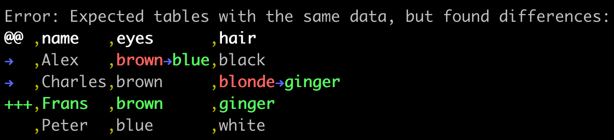

## assertEqualTables

An assertion for spotting differences in lists of similar objects

```js
const assertEqualTables = require('assert-equal-tables')

const actual = [
  {
    name: 'Alex',
    eyes: 'brown',
    hair: 'black'
  },
  {
    name: 'Charles',
    hair: 'blonde',
    eyes: 'brown'
  },
  {
    name: 'Peter',
    hair: 'white',
    eyes: 'blue'
  }
]

const expected = [
  {
    name: 'Alex',
    eyes: 'blue',
    hair: 'black'
  },
  {
    name: 'Charles',
    hair: 'ginger',
    eyes: 'brown'
  },
  {
    name: 'Frans',
    hair: 'ginger',
    eyes: 'brown'
  },
  {
    name: 'Peter',
    hair: 'white',
    eyes: 'blue'
  }
]

assertEqualTables(actual, expected)
```

...prints:


